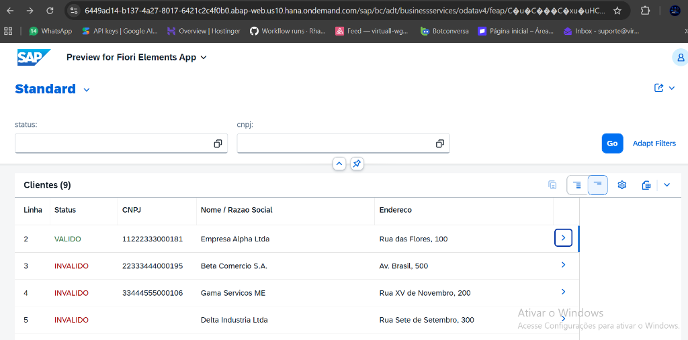
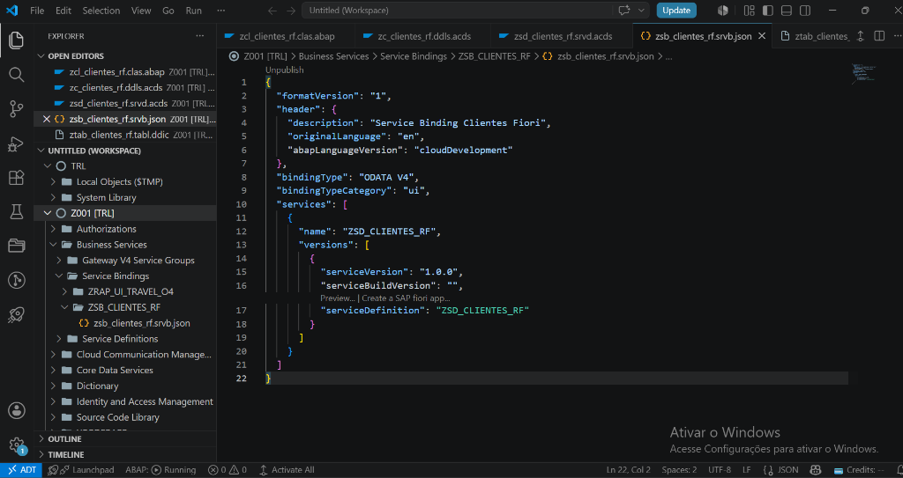
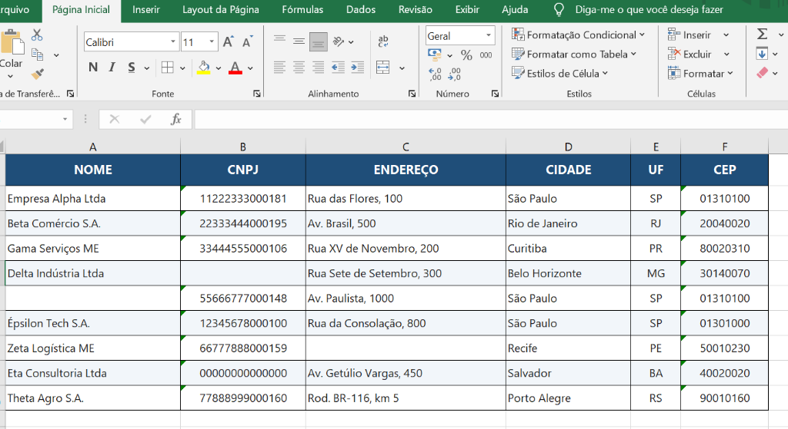

<div align="center">

# 🏢 SAP ABAP Cloud — Processamento de Clientes & SAP Fiori Elements

[](https://www.sap.com/products/technology-platform.html)
[](https://www.sap.com/products/technology-platform/hana.html)
[](https://www.sap.com/design/fiori.html)
[](https://code.visualstudio.com/)
[](https://github.com/SAP/styleguides/blob/main/clean-abap/CleanABAP.md)

<p align="center">
  <b>Solução ponta a ponta de engenharia de dados, validação matemática fiscal e exposição moderna em SAP Fiori desenvolvida no SAP BTP via Visual Studio Code.</b>
</p>

</div>

---

## 📌 Visão Geral da Arquitetura

O projeto resolve um dos desafios mais frequentes em consultorias e empresas de grande porte: **a carga, higienização, validação fiscal e apresentação de dados cadastrais legados** dentro do ecossistema SAP moderno (**S/4HANA / BTP**).

```
   [ Planilha Excel ]
           │
           ▼
[ ZCL_CLIENTES_RF ] ───────► Validação de Campos Obrigatórios (Nome, CNPJ, Endereço)
(ABAP Cloud / BTP)   ───────► Algoritmo Oficial do Módulo 11 (Dígitos Verificadores do CNPJ)
           │
           ▼
[ ZTAB_CLIENTES_RF ] ───────► Persistência no Banco SAP HANA com Criticality (Cores)
  (Database Table)
           │
           ▼
 [ ZC_CLIENTES_RF ]  ───────► CDS View Entity com Anotações UI (@UI.lineItem, @UI.selectionField)
  (Core Data Services)
           │
           ▼
[ ZSD_CLIENTES_RF ]  ───────► Service Definition & Binding OData V4
           │
           ▼
[ SAP Fiori Elements ] ─────► Web App com Filtros Dinâmicos, Badges Coloridos e Exportação
```

---

## 📸 Demonstração Visual da Aplicação

### 1. Aplicação SAP Fiori Elements em Execução (SAP BTP)
> Interface List Report gerada dinamicamente via CDS View Entity com filtros de pesquisa e badges semânticos de validação (*Criticality* 🟢 Verde para Válido / 🔴 Vermelho para Inválido).



### 2. Desenvolvimento no Visual Studio Code (SAP ADT & Service Binding)
> Arquitetura RAP moderna: Service Binding OData V4 publicado diretamente na nuvem pelo VS Code.



### 3. Dados de Entrada (Planilha Excel Modelo)
> Estrutura da planilha padronizada com dados consistentes e propositalmente inconsistentes para testes unitários de validação fiscal.



---

## 🎯 Principais Destaques Técnicos

1. **Stack de Última Geração da SAP**:
   - Desenvolvido no padrão **ABAP Cloud** (Clean ABAP) no **SAP BTP (Business Technology Platform)**.
   - Conexão e desenvolvimento direto via **Visual Studio Code** com o plugin oficial da SAP (**ADT**).

2. **Validação Matemática Oficial de CNPJ (Módulo 11)**:
   - Higienização automática de caracteres (`.`, `/`, `-`).
   - Bloqueio de sequências repetidas (`00000000000000`, `11111111111111`, etc.).
   - Cálculo aritmético dos pesos para o 1º e 2º dígitos verificadores usando `MOD 11`.

3. **Arquitetura RAP (RESTful Application Programming)**:
   - Modelagem de persistência com tabela transparente no **SAP HANA**.
   - Definição de **CDS View Entity** com semântica de *Criticality* (3 = Verde para Válido, 1 = Vermelho para Inválido).
   - Publicação de serviço **OData V4 UI** consumido por um **SAP Fiori Elements List Report**.

---

## 📊 Cenários de Teste & Validação

| Linha | Nome / Razão Social | CNPJ | Status Fiori | Diagnóstico do Sistema |
|:---:|:---|:---:|:---:|:---|
| **2** | Empresa Alpha Ltda | `11222333000181` | 🟢 **VALIDO** | Registro íntegro e aprovado para carga |
| **3** | Beta Comércio S.A. | `22333444000195` | 🔴 **INVALIDO** | `[CNPJ inválido]` (dígitos verificadores divergentes) |
| **4** | Gama Serviços ME | `33444555000106` | 🔴 **INVALIDO** | `[CNPJ inválido]` (dígitos verificadores divergentes) |
| **5** | Delta Indústria Ltda | *(Vazio)* | 🔴 **INVALIDO** | `[CNPJ vazio]` (campo mandatório) |
| **6** | *(Vazio)* | `55666777000148` | 🔴 **INVALIDO** | `[NOME vazio] [CNPJ inválido]` |
| **7** | Épsilon Tech S.A. | `12345678000100` | 🔴 **INVALIDO** | `[CNPJ inválido]` |
| **8** | Zeta Logística ME | `66777888000159` | 🔴 **INVALIDO** | `[CNPJ inválido] [ENDEREÇO vazio]` |
| **9** | Eta Consultoria Ltda | `00000000000000` | 🔴 **INVALIDO** | `[CNPJ inválido: sequência repetida]` |
| **10**| Theta Agro S.A. | `77888999000160` | 🔴 **INVALIDO** | `[CNPJ inválido]` |

---

## 🗂️ Estrutura do Repositório

```
├── src/
│   ├── ZCL_CLIENTES_RF.clas.abap     # Classe ABAP Cloud (regras de negócio & validação CNPJ)
│   ├── ztab_clientes_rf.tabl.ddic    # Tabela de persistência no SAP HANA
│   ├── ZC_CLIENTES_RF.ddls.asddls    # CDS View Entity com anotações de UI do Fiori
│   ├── ZSD_CLIENTES_RF.srvd.srvdsrv  # Service Definition (RAP)
│   └── ZCLIENTES_EXCEL.prog.abap     # Versão clássica On-Premise/ECC (ALV Grid CL_SALV_TABLE)
├── excel/
│   ├── modelo_clientes.xlsx          # Planilha Excel estilizada e formatada para carga
│   └── modelo_clientes.csv           # Modelo alternativo em CSV (UTF-8 com BOM)
├── docs/
│   └── README.md                     # Documentação com explicações conceituais didáticas
└── abap_trial_service_key.example.json # Modelo de credenciais do SAP BTP
```

---

## 💻 Como Reproduzir no SAP BTP

1. **Pré-requisitos**:
   - Conta no **SAP BTP Trial** com a instância do **ABAP Environment** ativa.
   - **Visual Studio Code** com a extensão oficial `sapse.adt-vscode`.

2. **Importação dos Objetos**:
   - Crie a tabela [ztab_clientes_rf.tabl.ddic](src/ztab_clientes_rf.tabl.ddic) no seu pacote.
   - Crie a CDS View [ZC_CLIENTES_RF.ddls.asddls](src/ZC_CLIENTES_RF.ddls.asddls).
   - Crie a Service Definition [ZSD_CLIENTES_RF.srvd.srvdsrv](src/ZSD_CLIENTES_RF.srvd.srvdsrv) e o Service Binding (`OData V4 - UI`).
   - Crie a classe [ZCL_CLIENTES_RF.clas.abap](src/ZCL_CLIENTES_RF.clas.abap) e execute com **F9** para processar e gravar no SAP HANA.

3. **Abertura da Interface Fiori**:
   - No Service Binding, clique em **Preview** na entidade `Clientes`.
   - O aplicativo **SAP Fiori Elements** será carregado no navegador!

---

<div align="center">
  <sub>Desenvolvido com foco nas melhores práticas de Clean ABAP, SAP BTP e SAP Fiori Elements.</sub>
</div>
